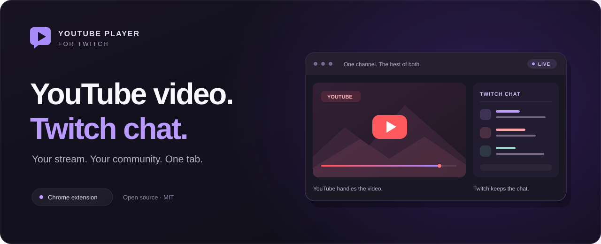

<p align="center">
  
</p>

<h1 align="center">YouTube Player for Twitch</h1>

<p align="center">
  Your stream on YouTube. Your community on Twitch.<br>
  A Chrome extension that brings a YouTube player into Twitch, keeping chat and the channel interface close by.
</p>

<p align="center">
  <a href="https://chromewebstore.google.com/detail/youtube-player-for-twitch/pkhipedofkjfffichjllpmoajlfndpad"></a>
  <a href="https://github.com/vrnrn/youtube-player-for-twitch/actions/workflows/chrome-web-store.yml"></a>
  <a href="LICENSE"></a>
</p>

<p align="center">
  <a href="#get-started">Get started</a> ·
  <a href="#features">Features</a> ·
  <a href="docs/usage.md">Usage guide</a> ·
  <a href="docs/development.md">Development</a> ·
  <a href="https://youtube-player-for-twitch.vrnrn.com/privacy/">Privacy</a>
</p>

---

When a streamer is live on both platforms, you can watch their YouTube feed without leaving their Twitch community. Find the stream automatically or paste a YouTube link, then keep using Twitch chat, badges and channel points from the same page.

## Get started

1. **[Install from the Chrome Web Store](https://chromewebstore.google.com/detail/youtube-player-for-twitch/pkhipedofkjfffichjllpmoajlfndpad).**
2. **Open a Twitch channel** and click **▶ YouTube** in the top navigation.
3. **Find your stream.** Choose **Find YouTube Stream → Use This Stream**, or paste a YouTube URL and click **Go**.

The extension pauses and mutes the underlying Twitch player. **Restore Twitch** brings it back with its original pause, mute and volume settings.

> Prefer to run the source? Follow the [unpacked installation guide](docs/development.md#load-the-extension-locally). Chrome 102 or newer is required.

## Features

| Watch and chat | Find and customize |
| :--- | :--- |
| **▶ YouTube playback, Twitch community**<br>Watch through YouTube's embedded player while keeping the Twitch channel interface. Playback quality depends on the source stream and YouTube's available options. | **⌕ Find the live stream**<br>Checks the streamer's linked YouTube channel first, then searches by Twitch channel name with fuzzy matching and live-result filtering. |
| **↻ Catch up to live**<br>Use **Sync Now** to seek toward the live edge and briefly catch up at 2× speed. Optional **Auto-sync** repeats every 10 minutes. | **♡ Pick up where you left off**<br>Restore playback after a reload, remember links per Twitch channel, revisit your last five streams and pin favorites. |
| **▤ Bring chat into fullscreen**<br>Optional floating chat mirrors Twitch messages, badges and emotes over the player. Move it, resize it and adjust its appearance. | **⚙ Make the player your own**<br>Keep Twitch at Source quality, hide native Twitch player-extension overlays, and find extra controls in a compact settings menu. |

Floating chat is **read-only** and starts off by default. Keep the normal Twitch chat open; use it to send messages and access moderation controls. [Explore chat and player settings →](docs/usage.md#floating-chat)

<details>
<summary><strong>Experimental: Twitch interruption blocking</strong></summary>

The optional **Interruption blocking** setting bundles the pinned TwitchAdSolutions VAFT v37.0.0 algorithm. It is **off by default**, runs only on Twitch, and reloads the page when toggled. Disable any other VAFT installation before enabling it.

Its effectiveness depends on Twitch, and alternate playlists can temporarily reduce quality. Actual interruption efficacy, real HEVC fallback and Chrome Web Store acceptance of this integration remain unverified. YouTube playback keeps its own behavior.

Read the [setup and limitations](docs/usage.md#experimental-interruption-blocking), [source and adapter notes](vendor/vaft/README.md), and [verification checklist](docs/vaft-qa.md).

</details>

## A few things to know

- **Use the matching stream.** Automatic search can suggest an approximate channel match; check the title and channel before selecting it. You can always paste a link yourself.
- **Sync is a catch-up control.** It seeks toward YouTube's live edge; it does not guarantee that video and Twitch messages arrive at exactly the same time.
- **Your preferences stay on your device.** Settings, history and playback state use Chrome's local extension storage. The extension has no developer analytics or telemetry; YouTube and Twitch handle their own requests. [Read the privacy policy](https://youtube-player-for-twitch.vrnrn.com/privacy/).

## Build, explore, contribute

Vanilla JavaScript, CSS and Manifest V3. No framework or npm dependencies are needed for the extension's tests and build.

```bash
git clone https://github.com/vrnrn/youtube-player-for-twitch.git
cd youtube-player-for-twitch
npm test
npm run build
```

The build creates a validated `release.zip`. See the [development guide](docs/development.md) for local installation, the source map, verification notes and the release workflow.

Found a bug or have an idea? [Open an issue](https://github.com/vrnrn/youtube-player-for-twitch/issues). For playback or chat problems, include your Chrome version and steps to reproduce the issue.

---

[MIT licensed](LICENSE). Bundled VAFT retains the [TwitchAdSolutions Contributors' MIT license](vendor/vaft/LICENSE). Floating chat was inspired by [Floating Twitch Chat](https://github.com/xD33m/floating_twitch_chat), with an original implementation for this extension.

<p align="center">
  <a href="https://youtube-player-for-twitch.vrnrn.com/">Website</a> ·
  <a href="https://github.com/vrnrn/youtube-player-for-twitch/releases">Releases</a> ·
  <a href="https://youtube-player-for-twitch.vrnrn.com/privacy/">Privacy policy</a>
</p>
