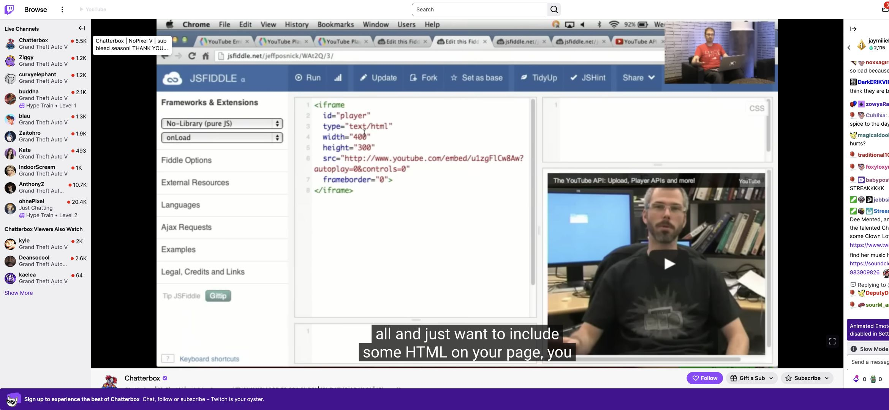
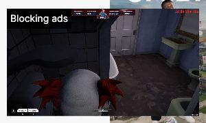

# Wide-window player and mini-player notice verification

Checked on October 8, 2026.

## Report and fix

A Chrome Web Store review reported that YouTube extended below the window at
aspect ratios wider than 16:9. At 2560×1080 on Chatterbox, Twitch's outer
`.video-player` measured 1980×1113.75 at y=50, while its bounded
`.video-player__container` measured 1980×920. The old comma-separated selector
selected the outer ancestor first in document order, putting YouTube's bottom
at y=1163.75 instead of y=970.

The playback owner now explicitly prefers `.video-player__container`, with
fallbacks for targeted layouts and the outer player. It observes the same
bounded element and keeps the existing YouTube iframe mounted during resizing.

The generated VAFT adapter now shows only **Blocking ads** in its notice. The
adapter generator was updated and the bundle regenerated; upstream is unchanged.

## Verification

- `npm run check`: all 70 tests passed, including wide-window and selector
  fallback regressions. The wide-window regression fails against the old source.
- `npm run build`: generated adapter, ZIP integrity and packaged-source checks passed.
- `git diff --check`: passed.

The edited playback owner was temporarily loaded into the installed extension's
isolated context on live Twitch in the integrated browser. The test used the
YouTube API sample video for layout checks, not a matching simulcast.

| Viewport | YouTube bounds after Twitch's layout settled |
| --- | --- |
| 1280×720 | 700×393.75 at (240, 50) |
| 1920×1080 | 1340×753.75 at (240, 50) |
| 2560×1080 | 1980×920 at (240, 50) |
| 3440×1440 | 2860×1280 at (240, 50) |
| 3840×1080 | 3260×920 at (240, 50) |

At every size, YouTube matched the inner player and remained within the window.
The same iframe survived resizing, native theatre entry/exit (2220×1080) and
wrapper fullscreen entry/exit (2560×1080). Twitch remained paused and muted
while YouTube owned playback.

For the notice check, the generated banner function was previewed with a
controlled active-ad status. Navigating to Browse produced Twitch's native
280×157.5 mini player. The short notice was approximately 94×30 and left the
close button visible. The installed adapter's longer text was temporarily held
at the preview value while capturing the screenshot, then restored. This checks
layout, not live ad-blocking efficacy. Temporary previews and the tab were removed.

These are source-preview checks; a fresh installation of the generated release
archive was not tested in the browser.
